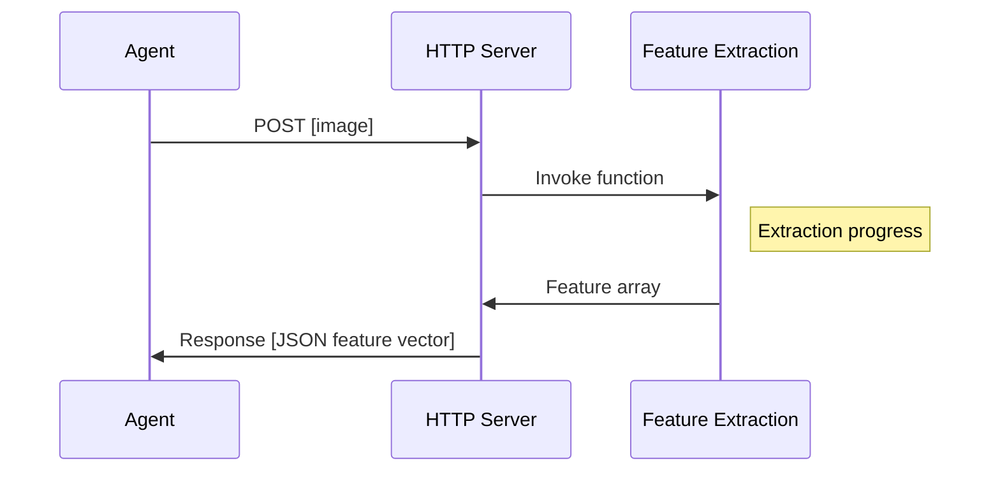
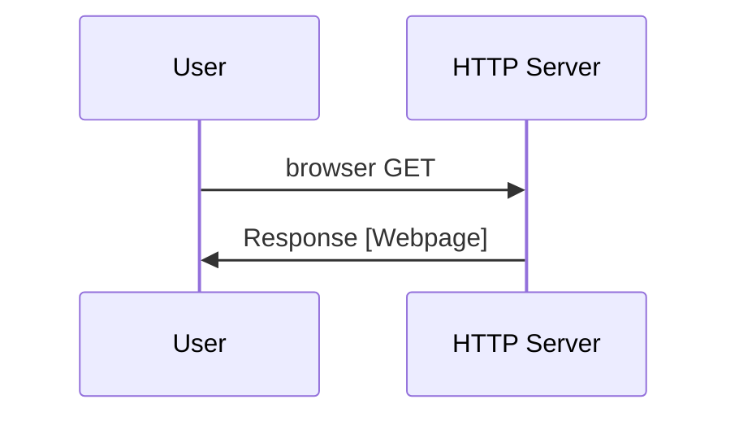

**General problem:** 
- Wrapping existing functionality with a front-end layer

**General goal:** 
- Achieve discrete granularity of modules that can be chained to form a pipeline

---

**Specific problem:** 
- Wrapping Resnet feature extraction on Google Colab with a front-end layer

**Specific goal:** 
- A ready-to-run object (Colab notebook) that can be set up instantly
- Capable of chaining inputs/outputs in JSON format over normal HTTP protocol
- Passive access: Capable and is expected to be accessed from outside

---

**Solution progress:**

 **1. Acquire feature extraction script**

The fastest way to have a pre-trained Resnet classifier is with keras (21 lines). The implementation is modified to be in a clear form of a function, with one input and one output. Resnet-50 model is used.

Blockages: 
 - The example code uses default pooling method, which results in the output shape of (1,7,7,2048). Some researches suggests that it is due to a bottleneck layer imposed by the pooling layer. So the pooling has to be modified. This [stackoverflow link](the%20example%20code%20uses%20default%20pooling%20method,%20which%20results%20in%20the%20output%20shape%20of%20%281,7,7,2048%29,%20while) suggests the pooling layer has to be `avg` in order to give the desired output shape of 2048.

Solutions:

- Modify pooling layer to `avg`.

 
 **2. Wrapping a simple HTTP server for inputs/outputs**
 
A HTTP server is required to form a front-end layer that prepares and invokes the Resnet feature extraction script. The script takes an image filename and gives a numpy array, so the following interaction is used:

To ease the debugging process where image is manually uploaded, the HTTP Server also has a default site to facilitate POST request using a browser:

**3. Passive access**

Being a pipeline element requires the code to be capable of running on demand. 

Blockages:

- Google Colab by default is behind firewall and is non-configurable because it is used for research purposes. File IO is done over Google Drive, and ports are proxied to the browser (open ports on the Colab VM are redirected to the user machine, e.g VM:56789 is mapped to localhost:65432).

Solutions:

- Set up an intermediate public SSH machine (Digital Ocean). Ideally, Colab VM will create a connection to this machine, which will forward traffic from the public back. However, once the machine was set up, Colab could not connect to the newly-created public SSH machine due to further restrictions on key validation, thus it cannot create a tunnel to the public machine.
- Using public intermediate services. [`ngrok`](https://ngrok.com/) is a  public tunelling service with simple setup. Using ngrok requires a python library to be installed.

---

**Steps to reproduce:**

 1. Download the notebook [here](https://colab.research.google.com/drive/1ZGSOw8S25-sBFN2heZGDKpy2biboBYpf).
 2. Sign in/Sign up [https://ngrok.com/](https://ngrok.com/) account. 
 3. Go to [https://dashboard.ngrok.com/get-started/setup](https://dashboard.ngrok.com/get-started/setup) and copy the authtoken (only the token, without `./ngrok authtoken`)
 4. Locate HTTP Server section in the notebook
 5. Locate the cell which contains `def run`
 6. Change the line `ngrok.set_auth_token(   )` with copied token
 7. Run notebook.
